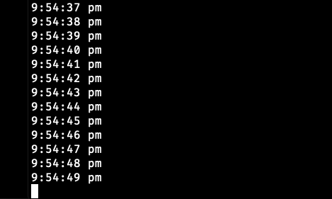
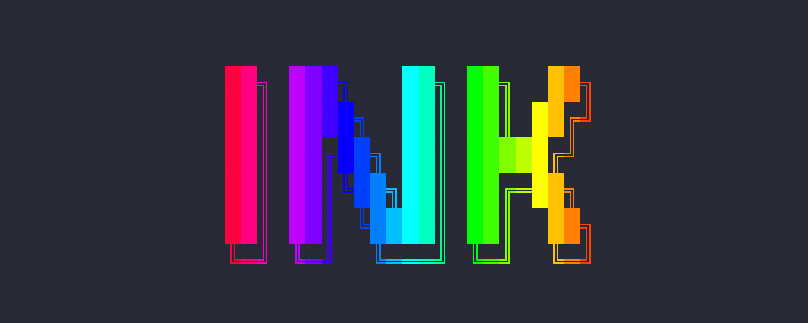

export { default as themes } from "./theme.js";

import { Head, Appear, Notes, Image } from "mdx-deck";
import { Twemoji as Emoji } from "react-emoji-render";
import QRCode from "qrcode.react";

import Mono from "./Mono.js";

<Head>
  <title>Delightful CLI Tools with Node and Ink</title>
  <meta name="twitter:card" content="summary_large_image" />
  <meta name="twitter:site" content="@hexrcs" />
  <meta name="twitter:title" content="Delightful CLI Tools with Node and Ink" />
  <meta
    name="twitter:description"
    content="Text based CLI tools are wonderful. They are fast, lightweight, and universally accessible. Best of all - building them in modern JavaScript is a delightful experience. In this talk, you will be introduced to the Node.js ecosystem for building CLI tools. We will then take a deeper look at Ink v2 - a super awesome library that allows us to use React and Flexbox to create complex, dynamic, and interactive command-line interfaces."
  />
  <meta
    name="twitter:image"
    content="https://kajs-node-cli-talk.netlify.com/cover.png"
  />
  <link
    rel="stylesheet"
    href="https://cdn.jsdelivr.net/gh/tonsky/FiraCode@1.207/distr/fira_code.css"
  />
</Head>

# Delightful Command-Line Interfaces

<h2>with Node and Ink <Emoji svg text="🌈" /></h2>

<Mono>Xiaoru Li || "Leo" || @hexrcs</Mono>

---

<Emoji svg text="Hi there! :wave:" />

<h2>My name is Xiaoru Li <Emoji svg text="🇨🇳" /></h2>

You can also call me _Leo_

<Mono>
  Student, Web, ML, <Emoji svg text="🎹" />
</Mono>

---

# Everything started with the terminal

<Notes>
Back in the 60s, using CLI is the defacto way users interact with computers,
through a terminal.

Evolves. Not pure text any more, more features are added, such as ANSI escape code

</Notes>

---


<Appear>
  <h3>1978, 80x24, ANSI support</h3>
</Appear>

<Notes>
VT100 is the first to support ANSI escape code, which allows meta features 
like erasing text.

After GUI OSs became popular, we use emulators. Most popular one - xterm,
emulates the VT series in its earlier versions.

</Notes>

---

<h1>Command Line Interfaces in 2019?? <Emoji svg text="🤔" /></h1>

<Appear>
  <h2>
    Old, but not obsolete <Emoji svg text="💡" />
  </h2>
  <div>
    In fact, best stuff in the dev world continues to be written for CLI
  </div>
</Appear>

<Notes>
  Because generally
  <ul>
    <li>easier to automate via scripting</li>
    <li>don't need to use a mouse, accelerates actions per minute count</li>
    <li>lightweight - can run headlessly</li>
    <li>SSH over 2G</li>
  </ul>
</Notes>

---

# How do we start

## with Node?

<Notes>surprisingly easy</Notes>

---

Obviously...

```js
console.log("Hello World!");
```

# <Emoji svg text=":D" />

<Notes>
save to a JS file, ask node to run that line of code.

one <strong>IMPORTANT</strong> thing to keep in mind is that this console is not hidden in the devtools, it's the place users interact with our application.

</Notes>

---

## In a browser, you can use CSS in `console.log`

---

```js
console.log(
  "%cconsole.log is %cfancy",
  "color: white; background: orange; font-weight: bold;",
  "border-style: dashed;  font-size: 25px; margin: 4px;"
);
```

<div
  style={{
    display: "flex",
    flexDirection: "row",
    alignItems: "center",
    justifyContent: "center",
  }}
>
  <h2 style={{ margin: "5rem" }}>
    <Emoji svg text="👉" />
  </h2>
  
</div>

<Notes>
Use % C to start a styled chunk, supply the styles for each chunk as additional parameters of the console.log call.

</Notes>

---

## `xterm` ain't Chrome (or FireFox)

# <Emoji svg text="😔" />

<Notes>
However, this is not possible in terminal, because the dev tools interface in a browser is also a webpage itself, so it's only natural that we can use CSS to style things there.

</Notes>

---

# ANSI escape code

<Mono big>ANSI === "American National Standards Institute"</Mono>

<Appear>
  <h3>
    Boy they are ugly <Emoji svg text="😅" />
  </h3>
</Appear>

<Notes>
ANSI escape code are special character sequences that are used for controling the cursor
location, text color, and other options.

And they look pretty ugly if you just wanna look at them.

</Notes>

---

import KarlsruheJS from "./KarlsruheJS.js";

```js
console.log(
  "\u001b[43m" + // Yellow background
  "\u001b[30m" + // Black text
  "\u001b[1m" + // Bold font
  "Karlsruhe" + // Payload 1
  "\u001b[41m" + // Red background
  "JS" + // Payload 2
    "\u001b[0m" // Reset styling
);
```

<div
  style={{
    display: "flex",
    flexDirection: "row",
    alignItems: "center",
    justifyContent: "center",
  }}
>
  <h2 style={{ margin: "5rem" }}>
    <Emoji svg text="👉" />
  </h2>
  <KarlsruheJS />
</div>

<Notes>
Let's have a look at the styling options ANSI escape code give us.

The first character "\u001b" is a non printable character, signaling the start of an ANSI escape sequence. If you don't reset at the end, all text outputs will be rendered with styles.

</Notes>

---

## What else can ANSI escape code do?

<Appear>
  <h3>
    Cursor manipulation <Emoji svg text="📝" />
  </h3>
</Appear>

<Notes>
transition: Let's think about how ...

</Notes>

---

## How do we remove or overwrite printed text? <Emoji svg text="🤔" />

<Appear>
  <h2>
    We move the printer head to previous positions <Emoji svg text="💡" />
  </h2>
</Appear>

<Notes>
transition: And there are ANSI escape code exactly for this purpose...

</Notes>

---

### A simple clock

```js
function clock() {
  setInterval(() => {
    const time = moment().format("h:mm:ss a");
    console.log(time);
  }, 1000);
}
```

---



Not so nice <Emoji svg text="😕" />

<Notes>
=><strong>You may have noticed that there's always a new line after we printed something with console.log, that's because...</strong>

</Notes>

---

### Under the hood

```
console.log()
```

is based on the low level

```
process.stdout.write()
```

with an extra "new line" on the end

---

### A better clock

```js
function betterClock() {
  setInterval(() => {
    const time = moment().format("h:mm:ss a");
    process.stdout.write("\u001b[1000D\u001b[K");
    process.stdout.write(time);
  }, 1000);
}
```

Move back 1000 columns, remove everything till end of the line

---

## Surely there're npm packages

## that encapsulate these low level tasks

# Right? <Emoji svg text=":D" />

---

<Image src="./images/node-cli-awesome-list.png" size="contain" />

---

## What we've just learnt can easily be done

## with libraries like `chalk` and `log-update`

---

### Write KarlsruheJS with `colored chalks`

<!-- prettier-ignore -->
```js
console.log(
  chalk.black.bgYellow.bold(
    "Karlsruhe" +
    chalk.bgRed("JS")
  )
)
```

No more %\$#@&\*! <Emoji svg text=":D" />

---

### A new clock with `log-update`

```js
function bestClock() {
  setInterval(() => {
    const time = moment().format("h:mm:ss a");
    logUpdate(time);
  }, 1000);
}
```

Keeps rewriting onto a "session"

<Notes>
No need reinventing wheels.

</Notes>

---

# Good CLI apps should be

## interactive, dynamic and responsive

<Notes>
User should be constantly provided with the latest information, and the 
interface should not fall apart inside a non-standard dimension.

Because we resize terminal windows all the time.

</Notes>

---

### Jest's running and watch mode

<div
  dangerouslySetInnerHTML={{
    __html: `
      <video
        style="max-width: 60%"
        loop
        autoplay
        muted
        src="./images/jest.mp4"
      />
    `,
  }}
/>

Real time status <Emoji svg text="🧭" /> Keyboard interaction <Emoji svg text="👨‍💻" />

---

## We have the building blocks

### But layouts in a pure text environment are still tough <Emoji svg text="😕" />

### Managing updates for multiple chuncks is even tougher <Emoji svg text="😂" />

---

## Behold, we have `Ink`! <Emoji svg text="🌈" />



<Appear>
  <div style={{ marginTop: "4em" }}>
    <h3>
      <Emoji svg text="✅" /> Custom React renderer
    </h3>
    <h3>
      <Emoji svg text="✅" /> Flexbox magic in the terminal
    </h3>
  </div>
</Appear>

---

# React is a paradigm

---

### Reusable components

<Appear>
  <h3>Design views for each state</h3>
  <h3>Blackbox diff checker</h3>
  <h3>Bring your own "renderer"</h3>
</Appear>

<Notes>
1. Views are consisted of <strong>reusable components</strong>

2. We design simple views for each state in the application, so app behavior is predictable.

We essentially say, if we have this state, the app should look like this; if the state changes, the app should look like that. Declarative, no need to do things imperatively...

3. Because library itself boiled down to its essence = a just powerful blackbox diff checker, to efficiently update just the right parts based on state changes.

Here, we don't need to manually remove col X to col Y, we just say, we want a timer at this position, saying 1s when the state is 1s, we want it say 2s when it's 2s. React, you take care of finding out what parts to add or remove.

4. You can write custom renderers to interpret React's internal virtual DOM. That's why it is not just a web interface library, there're RN, ReactVR and so on, including Ink.

</Notes>

---

# Flexbox for text based interfaces?

<Appear>
  <h3>That way we don't need to count absolute columns or rows by hand...</h3>
  <h3>Automatic width, heights, margins...</h3>
</Appear>

# <Emoji svg text="🤔" />

<Notes>I'm not an expert on CSS...</Notes>

---

## Flexbox is like water flow...

<Appear>
  
  <h3>
    Not like that one though <Emoji svg text="☝️" />
  </h3>
</Appear>

---

## flex-direction


---

## justify-content


---

## align-items


---

# Let's have a closer look at Ink!

# <Emoji svg text=":D" />

---

```jsx
import React, { useEffect, useState } from "react";
import { Text, Box, Color, render } from "ink";
import Gradient from "ink-gradient";
import BigText from "ink-big-text";
import Spinner from "ink-spinner";
import TextInput from "ink-text-input";

import { useKeypress } from "./demos/useKeypress";
```

Import components and utilities we need first <Emoji svg text="☝️" />

<Notes>
There are also pre-built 3rd party components, which are specialized at making colorful text or capturing keystokes, making our life much easier

I'm using ES6 modules import syntax here, not the conventional commonjs "require" statements to import libraries. You'll need to use Babel.

</Notes>

---

```jsx
const Counter = () => {
  const [value, setValue] = useState(0);
  useKeypress(() => setValue(value + 1));

  return (
    <Box marginY={3} justifyContent="center">
      <Box>Press any key to increment: {value}</Box>
    </Box>
  );
};

render(<Counter />);
```

Classic counter example, CLI edition <Emoji svg text="☝️" />

---

<div
  dangerouslySetInnerHTML={{
    __html: `
      <video
        style="height: 80vh;"
        loop
        autoplay
        muted
        src="./images/demo-counter.mp4"
      />
    `,
  }}
/>

---

## A more complex example?


---

```jsx
const AppContext = createContext();
const Wiki = () => {
  // init keypress handling, useStates and so on...
  return (
    <AppContext.Provider value={{ ...statesAndSetters }}>
      <Box flexDirection="column">
        <InstantSearchBar />
        <ResultsListing />
        <StatusInfoBar />
      </Box>
    </AppContext.Provider>
  );
};

render(<Wiki />);
```

Outline of the UI <Emoji svg text="☝️" />

---

```jsx
const InstantSearchBar = () => {
  const appContext = useContext(AppContext);
  return (
    <Box marginY={1}>
      <Text bold>Keywords: </Text>
      <TextInput
        value={appContext.input}
        onChange={value => handleChange(value, appContext)}
      />
    </Box>
  );
};
```

Inside the search bar <Emoji svg text="☝️" />

---

<!-- prettier-ignore -->
```jsx
const ResultsListing = () => {
  const appContext = useContext(AppContext);
  return (
    <Box marginY={1} flexDirection="column">
      {appContext.results.map((result, i) => (
          <ResultCard result={result} key={i}
          isSelected={appContext.selectedIndex === i} />
        ))}
    </Box>
  );
};
```

Inside the result listing section <Emoji svg text="☝️" />

---

```jsx
const ResultCard = ({ result, isSelected }) => {
  return (
    <Box marginBottom={1}>
      <Box flexDirection="column">
        <Color blue bgRed={isSelected}>
          <Text bold>{result.title}</Text>
        </Color>
        <Box textWrap="wrap">{result.description}</Box>
      </Box>
    </Box>
  );
};
```

Inside a single result card <Emoji svg text="☝️" />

---

```jsx
const StatusInfoBar = () => {
  const appContext = useContext(AppContext);
  return (
    <Box marginY={1}>
      {!!appContext.results.length && (
        <Color gray>
          <Text bold>Found {appContext.results.length} results!</Text>
        </Color>
      )}
    </Box>
  );
};
```

The status info bar <Emoji svg text="☝️" />

---

<div
  dangerouslySetInnerHTML={{
    __html: `
      <video
        style="height: 80vh;"
        loop
        autoplay
        muted
        src="./images/demo-wiki.mp4"
      />
    `,
  }}
/>

---

Many big projects have started adopting Ink v2

## Gatsby's CLI is now based on Ink

## npm, Jest are also testing out Ink

---

### More awesomeness with Ink


<Notes>
We've been mainly focusing on dynamic user interfaces tonight, but in many cases we actually want as little user interaction with the program as possible, which helps with automation.

Pastel is a framework based on Ink, which looks at how the source code files are structured, then it will use the project structure as its API, very similar to the way you write routes for Next.js.

</Notes>

---

```text
git-js/
  - package.json
  - commands/
    - index.js
    - add.js
    - checkout.js
    - commit.js
    - stash/
      - index.js
      - clear.js
        ...
```

`git stash clear` anyone?

<Notes>
This is particularly useful for building an app with commands and subcommands like git. You can nest directories, and pastel will convert the hierarchy into nested commands. The logic of each command is encapsulated its own React component, so you have a completely modularized application.

The option and flags passed to the command will be fed into the React component as props.

Super cool.

</Notes>

---

## But do we always use "`npm run`" (or "`yarn`")?

## They sure don’t look well-polished to me <Emoji svg text="😅" />

---

# We can fix this <Emoji svg text="💪" />

---

### Shebang <Emoji svg text="#️⃣⚠️" />

```js
#!/usr/bin/env node

// real script starts here...
console.log("Hello world!");
```

Put a Shebang at the beginning of the entrance JS file

---

### Executable <Emoji svg text="💥" />

```bash
$ chmod +x dist/index.js
```

Flag the entrance JS file as an executable

---

### Specify `bin` in `package.json`

```json
{
  // blah blah blah
  "description": "My awesome CLI tool!",
  "bin": {
    "awesome": "./dist/index.js"
  }
  // blah blah blah
}
```

For installing into global `PATH`

---

# Now you can run `npm link` <Emoji svg text=":D" />

<Appear>
  <h2>Or publish on the public `npm` registry</h2>
</Appear>

<Notes>
This will let npm create a symlink in the npm global installs folder, pointing to your project. Essentially doing a private global installation

</Notes>

---

# `npm i -g wiki-cli`

A more polished wiki client with TypeScript and MobX.

---

<Image src="./images/thats-all-folks.png" size="contain" />

---

# Thank you! <Emoji svg text="🙌" />

Source code of slides and demos can be found here <Emoji svg text="👇" />

<div
  style={{
    display: "flex",
    justifyContent: "center",
  }}
>
  <div
    style={{
      padding: "1rem",
      backgroundColor: "white",
    }}
  >
    <QRCode
      value="https://github.com/hexrcs/201907-kajs-node-cli-talk"
      size={500}
    />
  </div>
</div>

`https://github.com/hexrcs/201907-kajs-node-cli-talk`

## I survived! <Emoji svg text=":D" />

---

### Links and Acknowledgements

NPM modules

- [Ink](https://github.com/vadimdemedes/ink)
- [Pastel](https://github.com/vadimdemedes/pastel)
- [log-update](https://github.com/sindresorhus/log-update)
- [chalk](https://github.com/chalk/chalk)

Articles

- [Awesome List - Node CLI utils](https://github.com/sindresorhus/awesome-nodejs#command-line-utilities)
- [More about ANSI escape code](https://en.wikipedia.org/wiki/ANSI_escape_code)
- [A great article on building vanilla CLI tools with Python](http://www.lihaoyi.com/post/BuildyourownCommandLinewithANSIescapecodes.html)

Images

- [VT100](https://en.wikipedia.org/wiki/VT100#/media/File:DEC_VT100_terminal.jpg)
- [Laminar flow gif](https://giphy.com/gifs/flow-laminar-vKhN9zlku7wQ)
- [Flexbox animations](https://www.freecodecamp.org/news/an-animated-guide-to-flexbox-d280cf6afc35/)
- [That's all folks](https://twitter.com/ontariocofc/status/803779593631105024)
